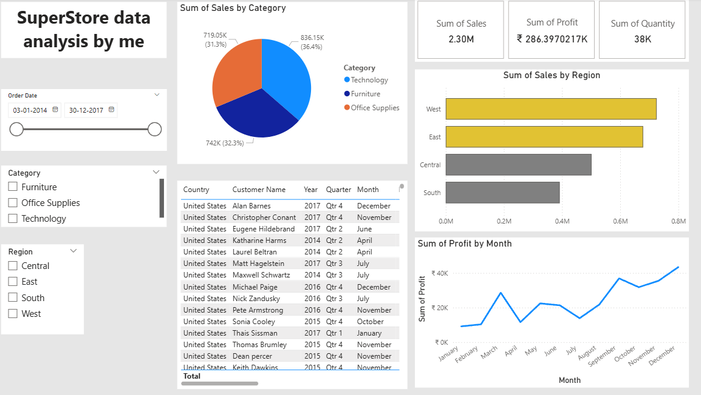

# 📊 Power BI Superstore Dashboard

This project is a Power BI dashboard created from the **Sample Superstore dataset**, showcasing sales performance, profit trends, and product category analysis.

---

## 📁 Project Structure
```
├── PowerBI_Superstore_Dashboard.pbix # Main dashboard file
├── Export/
│ └── SuperstoreDashboard.pdf # Exported PDF of the dashboard
├── assets/
│ └── SampleSuperstore.xlsx # Dataset used for the project
├── screenshots/
│ └── dashboard.png # Preview of the dashboard
```

---

## 🎯 Objective

- Analyze sales, profit, and quantity across regions and product categories
- Identify monthly profit trends
- Create an interactive dashboard with slicers and filters for deep dives

---

## 🛠 Tools Used

- Power BI Desktop
- Power Query Editor (for data cleaning)
- DAX (for formatting measures)
- Sample Superstore Dataset (CSV)

---

## 🔍 Key Insights

- **West region** leads in sales overall
- **Technology** category contributes the highest profit
- Monthly profit fluctuates, with visible peaks in Q4
- Slicers allow dynamic filtering by region, category, and date

---

## 📸 Dashboard Preview



---

## 📂 Download the Dashboard

You can download and explore the `.pbix` file:
[Download PBIX](./PowerBI_Superstore_Dashboard.pbix)

Or view the exported PDF:
[View PDF](./Export/SuperstoreDashboard.pdf)

---

## ✅ Contact

Feel free to connect if you’d like to collaborate or give feedback:
- LinkedIn: [www.linkedin.com/in/sahfeerul-wasihf]
- Email: [wasihfwork@gmail.com]
